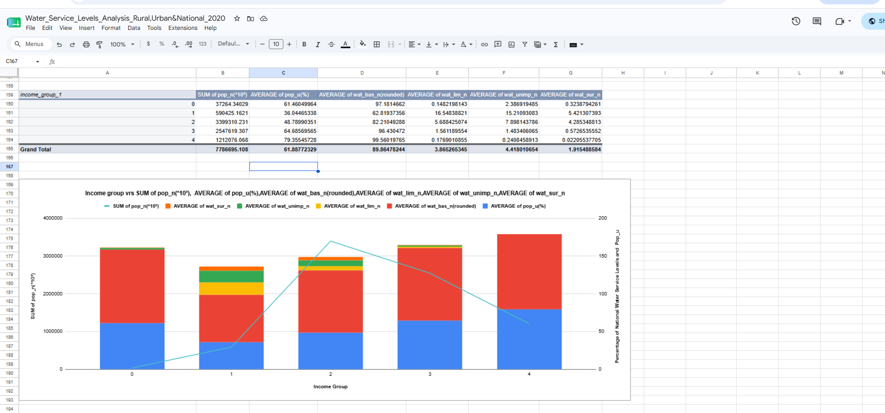
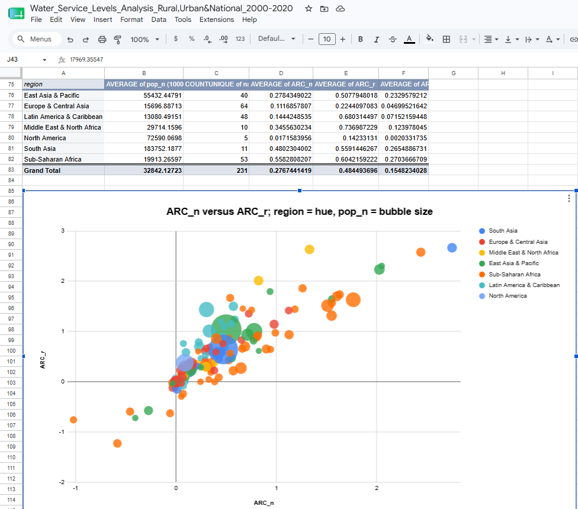

# WHO-UNICEF-Global-Access-To-Water
---

##**Overview**

This project involves the analysis of the global access to good drinking water using two different dataset. One analysis deals with access to water across the three population groups; rural, urban and national and how gross national income(GNI) can affect acountry's or a popuplation group access to safe drinking water for the year 2020. The other deals with how global access to safe drinking water has changed over the period 2000 to 2020.

---

##**Project Objectives for the 2020 Dataset**

The main objectives of this analysis were to:
1. Determine how population size across three main population groups affects access to safe drinking water.
2. Determine the effect of gross national income on the accessibility of safe drinking water.
---

##**Project Objectives for the Period 2000-2020 Dataset**

The main objectives of this analysis were to:
1. Compare the annual rate of change (ARC) in acesss to safe drinking water across the three populations groups; rural, urban and national.
2. Compare the annual rate of change in acesss to safe drinking water among the various regions of the world; South Asia, Europe & Central Asia, Middle East & North Africa, East Asia & Pacific, Sub-Saharan Africa, Latin America & Caribbean, and North America.
3. Analyze the impact of population size on ARC.
---

##**Dataset Information**

| Attribute | Description |
|---|---|
| Dataset Type | Access to water data |
| Source |  WHO/UNICEF JMP for 2020 & WHO/UNICEF JMP from 2000 to 2020 |
| Records | 213 rows for 2020 dataset & 464 rows for 2000 to 2020 dataset |
| Tool Used | Google Sheets |
---

##**Tools and Features Used**

This project was completed entirely in Google Sheets using:
1. Pivot tables
2. Charts and graphs
3. Formulas
4. Functions
---

##**Features**

name - The country or area name, income_group - The country’s classification according to income group, pop_n- The national population size estimate, in thousands, pop_u - The urban population share estimate in percentage points (%), _wat_bas_n_ - The estimated national share of people with at least basic service(%)*, _wat_lim_n_ - The estimated national share of people with limited service (%), _wat_unimp_n_ - The estimated national share of people with unimproved service (%), _wat_sur_n_ - The estimated national share of people with surface service (%), _wat_bas_r_ - The estimated rural share of people with at least basic service (%), _wat_lim_r_ - The estimated rural share of people with limited service (%), _wat_unimp_r_ - The estimated rural share of people with unimproved service (%), _wat_sur_r_ - The estimated rural share of people with surface service (%), _wat_bas_u_ - The estimated urban share of people with at least basic service (%), _wat_lim_u_ - The estimated urban share of people with limited service (%), _wat_unimp_u_ - The estimated urban share of people with unimproved service (%), _wat_sur_u_ - The estimated urban share of people with surface service (%), year - The year for which the data was collected for every country for the period 2000 to 2020

---

##**Key Functions Used**

1. IF()
2. SORT()
3. LOOKUP()
4. ABS()
5. MIN()
6. MAX()
7. AVERAGE()
8. MODE()
9. MEDIAN()
10. STDEV.P()
11. COUNTA()
12. COUNTIFs()
---

##**Data Cleaning Process**

The dataset was cleaned and prepared by:
1. Split headings and dataset into appropriate columns
2. Created new features
3. Handling blank cells
4. Standardizing values
5. Removing duplicate records
---

##**Analysis Performed for the 2020 Dataset**

1. Investigated what access to water at the different service levelslooks like for people in specifictypes of areas (national, urban, and rural).
2. Investigated what access to water at the different service levels looks like for different population sizes.
3. Investigated the relationship between GNI (gross national income) or income group, population size, urbanization, and national water access.
---

##**Analysis Performed for the period 2000 - 2020 Dataset**

1. Analysed the Annual Rates of Change (ARC) to see whether the proportion of access to drinking water is declining or improving.
2. Investigated whether countries have made significant enough effort to improve access to water in the years leading up to 2020.
3. InvestigateD whether more or less progress has been made in increasing access to basic water services in specific regions across the world.
---

##**Key Insights for the 2020 Dataset**

Some major findings from the analysis:
1. Countries with greater urban population shares are more likely to provide basic water service than countries with smaller urban population shares.
2. High-income countries are on average more urbanized than low, lower-middle, and upper-middle-income countries.
3. More people included in this dataset live in lower-middle-income countries than in any of the other types of economies.
4. On average, the greater the GNI, the more urbanized.
5. Visualizing the pivot table values for national access versus income group indicates that as urbanization increases, so does the share of the population with basic water access, and as GNI increases, limited, unimproved, and surface water access decreases.
---

##**Key Insights for the Period 2000 - 2020 Dataset**

Some major findings from the analysis:
1. Although access to basic water services on a national level increased for more countries, more countries had a decrease in access in urban than rural areas.
2. Countries in the sub-Saharan Africa region observed a greater spread in rural and national ARC values than other regions.
3. Countries with larger populations generally observed national ARC values between 0% and 1%.
---

##**Project Workbooks**

The entire project workbook for the estimates on the use of water dataset for 2020 contains:
- The raw data
- The cleaned data
- The analysis and visualizations

[View Google Sheets Workbook](https://docs.google.com/spreadsheets/d/1yajv1zM__qqeqCeEOjeLHUo13velyHi_1sTdSQdjgLg/edit?usp=sharing)

The The entire project workbook for the estimates on the use of water dataset from 2000 - 2020 contains:
- The raw data
- The cleaned data
- The analysis and visualizations
  
[View Google Sheets Workbook](https://docs.google.com/spreadsheets/d/1gGmuh7zW8GfW0OwVLsFnrVU-HPil8Y3kw8bHsOVbf_4/edit?usp=sharing)

---

##**Vizualizations**

##**Results and Conclusion**

##**Author**

Mawuwoe Kwasi Dumordzie
Data Analyst

